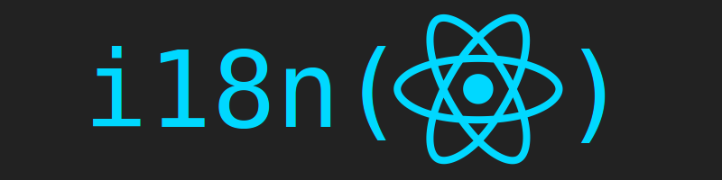

# Pets Platform Website Front

### Table of Contents

- [Prerequisites](#prerequisites)
- [Tech Stack](#Tecg-Stack)
- [Getting Started](#Getting-Started)
- [Project Structure](#Project-Structure)
- [Deployment](#Deployment)

#

### Prerequisites

-  npm @8 and up

#

### Tech Stack

-  React @ 18.3.1 - A JavaScript library for building user interfaces.
-  TypeScript @ 5.5.3 - Typed superset of JavaScript.
-  Tailwind CSS @ 3.4.10 - Utility-first CSS framework.
-  Axios @ 1.7.7 - Promise based HTTP client for the browser and Node.js.
-  sweetalert2 @ 11.13.1 - A beautiful replacement for JavaScript's alert.
-  Framer Motion @ 11.5.4 - Animation library for React.
-  React Router DOM @ 6.26.1 - Declarative routing for React.js.
-  i18next @ 23.14.0 - Internationalization framework for JavaScript.

#

### Getting Started

1. First of all you need to clone app repository from Github :

```
git clone https://github.com/Tusho7/pets-platform-front
```

2. Next step requires install all the dependencies.

```
npm install
```

3. Also you need to create .env file where copy information from .env.example file

```
Create a .env file based on the .env.example template.
```

4. To see project in action

```
npm run start
```

#

### Project Structure

```
src
├── components      # React components
├── contexts        # Page contexts
├── hooks          # Page hooks
├── i18n            # Language
├── modals          # Page modals
├── pages           # Page components
├── plugins         # Application plugins
├── services        # Application services
├── types           # Application interfaces
├── utils           # Utility functions
├── App.tsx         # Main application component
├── index.tsx       # Entry point file
└── main.tsx        # Main file for rendering React app
```

#

### Deployment

Before every deployment you need to create build file.

```

npm run build

```

after this you can use this file to deploy project on server.

### Components: Reusable React components.

### Contexts: Context providers for managing global state.

### hooks: Custom hooks for encapsulating logic.

### i18n: Internationalization setup for language support.

### Modals: Modal components used in various pages.

### Pages: Page components representing different views in the app.

### Plugins: Plugins used within the application.

### Services: Service functions for API calls and other functionalities.

### Types: TypeScript interfaces and types.

### Utils: Utility functions and helpers.

### App.tsx: Main application component.

### Index.tsx: Entry point file for the React app.

### Main.tsx: Main file for rendering the React application.

###

This README template provides a clear structure and instructions for setting up and understanding your Pets Platform Frontend project. Adjust the sections and details according to your specific project setup and requirements.
